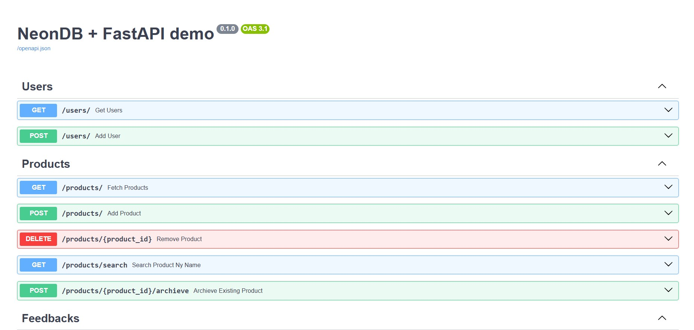

# NeonStore API - FastAPI Inventory & Feedback Management Backend

A scalable backend API built with FastAPI and Neon PostgreSQL that provides product inventory management, category organization, feedback handling, tagging, and user management.

Built with FastAPI, Neon PostgreSQL, SQLAlchemy ORM, and Pydantic for high-performance API development and structured data validation.

---

## Demo Link

[API Documentation](https://fast-api-neon-db-demo.onrender.com/docs)

---

## Quick Start

```bash
git clone https://github.com/pawanx/neon-fastapi-backend.git
cd neon-fastapi-backend
pip install -r requirements.txt
uvicorn app.main:app --reload
```

---

## Technologies

- FastAPI
- Python
- Neon PostgreSQL
- SQLAlchemy
- Pydantic
- Uvicorn
- REST APIs
- Dependency Injection
- Environment Variables

---

## Features

## Product Management

- Create new products
- Fetch all products
- Search products by name
- Delete products
- Archive products
- Inventory stock tracking

---

## Category Management

- Create product categories
- Fetch all categories
- Structured category organization

---

## Tag Management

- Create tags
- Fetch all tags
- Product classification support

---

## User Management

- Create users
- Fetch all users
- Email validation
- Duplicate prevention

---

## Feedback System

- Add customer feedback
- Fetch all feedback
- Filter feedback by name
- Delete feedback

---

## Product Feedback

- Add product-specific reviews
- Product rating support
- Comment-based feedback

---

## Data Validation

- Pydantic schema validation
- Request body validation
- Structured response models
- Error handling

---

## Database Integration

- Neon PostgreSQL cloud database
- SQLAlchemy ORM
- Optimized relational data handling

---

## API References

## Users

### **POST /users/**

Create a new user

Request:

```json
{
  "name": "Pawan Mishra",
  "email": "pawan@example.com"
}
```

Response:

```json
{
  "id": 1,
  "name": "Pawan Mishra",
  "email": "pawan@example.com"
}
```

---

### **GET /users/**

Fetch all users

---

## Products

### **POST /products/**

Create a product

Request:

```json
{
  "product_name": "Laptop",
  "quantity": 10,
  "in_stock": true
}
```

Response:

```json
{
  "id": 1,
  "product_name": "Laptop",
  "quantity": 10,
  "in_stock": true
}
```

---

### **GET /products/**

Fetch all products

---

### **GET /products/search?name=laptop**

Search products by name

---

### **DELETE /products/{product_id}**

Delete a product

Response:

```json
{
  "message": "Product deleted successfully"
}
```

---

### **POST /products/{product_id}/archieve**

Archive a product

---

## Categories

### **POST /categories/**

Create category

Request:

```json
{
  "name": "Electronics"
}
```

---

### **GET /categories/**

Fetch all categories

---

## Tags

### **POST /tags/**

Create a tag

Request:

```json
{
  "name": "Featured"
}
```

---

### **GET /tags/**

Fetch all tags

---

## Feedbacks

### **POST /feedbacks/**

Create feedback

Request:

```json
{
  "name": "Pawan",
  "comment": "Excellent product"
}
```

---

### **GET /feedbacks/**

Fetch all feedbacks

---

### **GET /feedbacks/?name=Pawan**

Filter feedback by user

---

### **DELETE /feedbacks/{feedback_id}**

Delete feedback

Response:

```json
{
  "message": "feedback deleted successfully"
}
```

---

## Product Feedback

### **POST /product_feedback/**

Add product feedback

Request:

```json
{
  "product_id": 1,
  "comment": "Amazing quality",
  "rating": 5
}
```

---

## Project Architecture

### API Layer:
- FastAPI routers
- Route handlers
- Dependency injection

### Service Layer:
- Business logic abstraction
- Database operations

### Schema Layer:
- Pydantic validation
- Request/response serialization

### Database Layer:
- Neon PostgreSQL
- SQLAlchemy ORM
- Session management

---

## Folder Structure

```bash
app/
│
├── routes/
│   ├── user_routes.py
│   ├── product_routes.py
│   ├── category_routes.py
│   ├── feedback_routes.py
│   ├── tag_routes.py
│   └── product_feedback_routes.py
│
├── schemas/
├── services/
├── dependencies/
├── models/
└── main.py
```

---

## Environment Variables

Create a `.env` file:

```env
DATABASE_URL=your_neon_postgresql_connection_url
```

---

## Running the Project

```bash
uvicorn app.main:app --reload
```

Visit:

```bash
http://127.0.0.1:8000/docs
```

for Swagger API documentation.

---

## Future Improvements

- JWT Authentication
- Role-based authorization
- Product pagination
- Search filters
- Advanced analytics
- Dashboard integration
- API rate limiting

---

## Screenshots

## Swagger Documentation



---


## Contact

For bugs, collaboration, or feature requests:

📧 **Email:** pawanmishra196@gmail.com

🔗 **Portfolio:** https://portfolio-pawanx.vercel.app

💼 **LinkedIn:** https://www.linkedin.com/in/pawan-mishra-08b3b9133/
